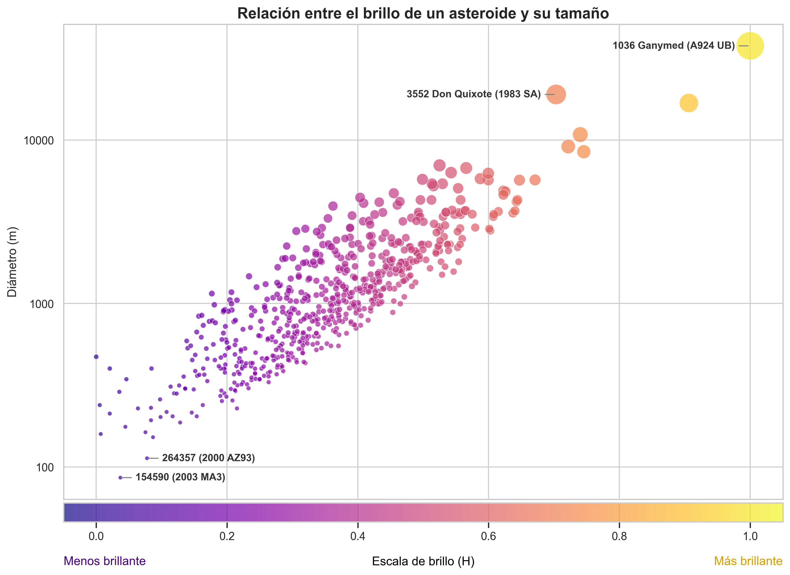
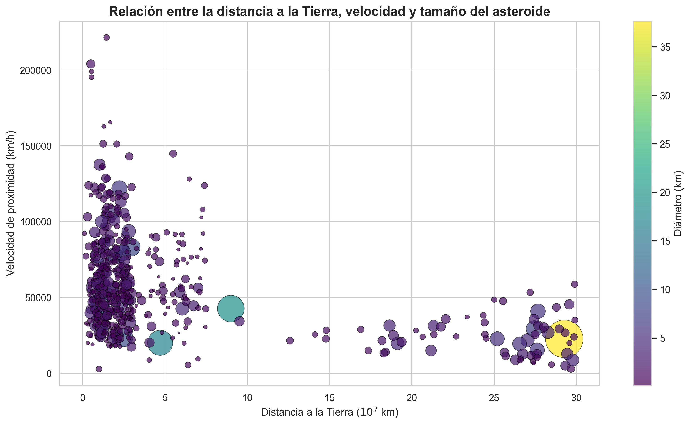
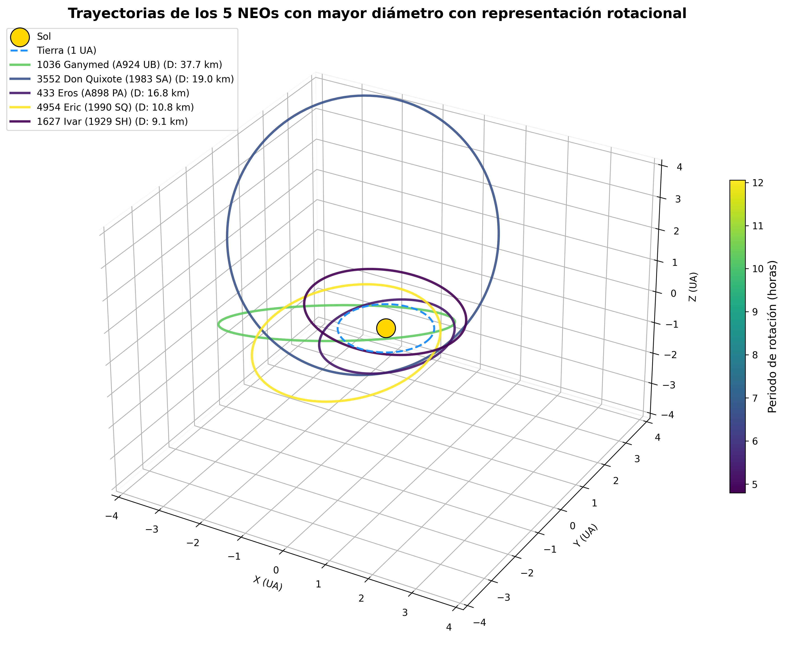
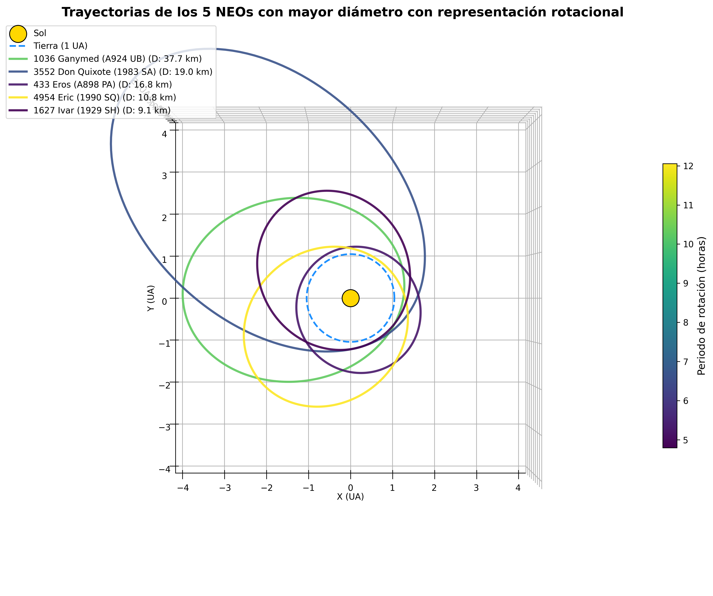
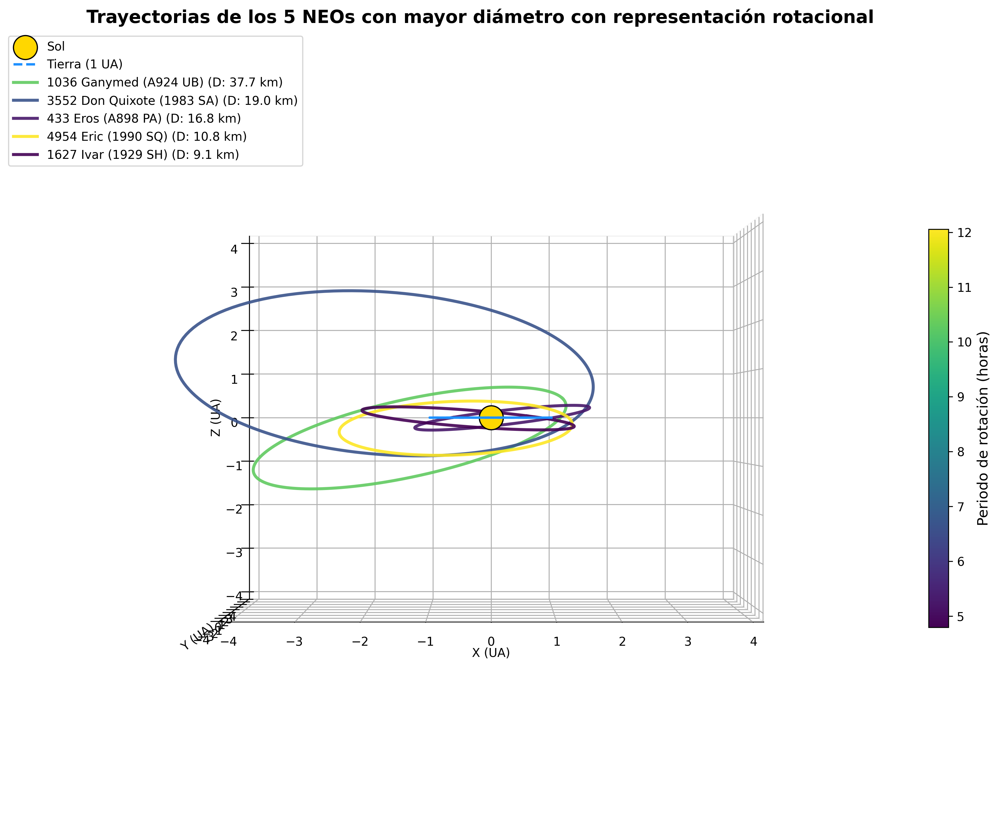

# Observaciones astronómicas
| Autor | No. de cuenta | Contacto |
| :---: | :---: | :---: |
| **Lina Nicole Reyes Nava** | 320209756 | [linareyes@ciencias.unam.mx](mailto:linareyes@ciencias.unam.mx) |
| **Rodrigo García Peláez** | 422059684 | [rodrigo090703@ciencias.unam.mx](mailto:rodrigo090703@ciencias.unam.mx) |

## Descripción
Este proyecto integra información proveniente de dos bases de datos oficiales de la NASA sobre Objetos Cercanos a la Tierra (**NEOs**, por sus siglas en inglés). El motor de procesamiento correlaciona los registros de ambas fuentes para generar un dataset unificado, consolidando únicamente los registros coincidentes para un análisis más preciso.

Una vez consolidado el conjunto de datos, se lleva a cabo un análisis multidimensional enfocado en responder a las siguientes preguntas de investigación:

1. ¿Existe una relación entre la magnitud absoluta (brillo) y el diámetro estimado de los asteroides?

2. ¿Cómo interactúan las variables de tamaño, velocidad y distancia mínima de aproximación en los NEOs?

3. ¿Cuáles son las trayectorias de los cinco asteroides con mayor diámetro registrado?

El proyecto procesa los resultados y utiliza diferentes técnicas de graficación para una clara interpretación de los resultados.

## Estructura del repositorio
```text
├── data/
│   ├── crudo/                        # Archivos fuente sin procesar
│   │   ├── nasa_neo1.csv             # Dataset de NeoWs API
│   │   └── nasa_neo2.csv             # Dataset de Small-Body DB
│   └── procesado/                    # Datasets limpios para el análisis
│       └── nasa_neo_unido.csv        # Dataset unificado listo para trabajar
├── resultados/                       # Salidas gráficas
│   ├── brillo_vs_tamanho.png         # Relación brillo - diámetro
│   ├── distancia_vs_velocidad.png    # Relación distancia - velocidad - diámetro
│   ├── trayectoria_vista1.png        # Vista isométrica de las trayectorias de los 5 asteroides de mayor diámetro
│   ├── trayectoria_vista2.png        # Vista superior de las trayectorias de los 5 asteroides de mayor diámetro
│   └── trayectoria_vista3.png        # Vista lateral de las trayectorias de los 5 asteroides de mayor diámetro
└── src/                              # Código fuente del proyecto
    ├── analisis/                     # Scripts dedicados al estudio de datos
    │   ├── brillo_vs_tamanho.py      # Graficación de la relación brillo - diámetro
    │   ├── distancia_vs_velocidad.py # Graficación de la relación distancia - velocidad - diámetro
    │   └── trayectorias.py           # Modelado de trayectorias de los 5 asteroides de mayor diámetro
    ├── extraccion/                   # Módulos de carga de datos
    │   ├── carga1.py                 # Extracción de datos de NeoWs API
    │   └── carga2.py                 # Extracción de datos de Small-Body DB
    └── transformacion/               # Lógica de procesamiento
        └── union.py                  # Script principal de unificación
```

## Fuentes de datos
| Fuente | URL | Descripción |
| :--- | :--- | :--- |
| **NeoWs (API)** | [apify.com](https://apify.com/compute-edge/nasa-neo-scraper) | Provee datos cinemáticos, incluyendo velocidad relativa y distancia a la Tierra y fechas de observación. También contiene clasificaciones de riesgo. |
| **Small-Body DB** | [ssd.jpl.nasa.gov](https://ssd.jpl.nasa.gov/tools/sbdb_query.html#!#results) | Repositorio con propiedades físicas del asteroide como diámetro y magnitud absoluta, excentricidad, etc. Además contiene datos de observaciones. |

## Flujo de trabajo
1. **Extracción:** Mediante los scripts `src/extraccion/carga1.py` y `src/extraccion/carga2.py`, se consumen las APIs correspondientes. Los datos son guardados localmente en la carpeta `data/crudo/` como `nasa_neo1.csv` (2000x12) y `nasa_neo2.csv` (1265x22) respectivamente.
2. **Transformación:** El script `src/transformacion/union.py` actúa como unificador, ejecutando los siguientes pasos:
   * **Limpieza:** Homogeniza el formatos y los tipos de datos.
   * **Correlación:** Identifica registros coincidentes mediante el uso de una llave única.
   * **Consolidación:** Fusión de las fuentes para generar un dataset único llamado `data/procesado/nasa_neo_unido.csv` (624x33), eliminando redundancias y preparando la estructura para el análisis.
3. **Análisis:** El dataset unificado es consumido por los scripts ubicados en `src/analisis/`, los cuales ejecutan los modelos estadísticos y generan las representaciones gráficas para poder interpretar los resultados del proyecto. Dichos resultados son almacenados en la carpeta `resultados/`.

## Estructura del dataset unificado ``data/procesado/nasa_neo_unido.csv``
| Columna | Tipo de Dato | Descripción |
| :--- | :--- | :--- |
| `id` | `int64` | Identificador único del asteroide en la base de datos de la NASA. |
| `name` | `object` | Nombre oficial y designación temporal del asteroide. |
| `nasaJplUrl` | `object` | URL de consulta en el *Small-Body Database* del JPL. |
| `absoluteMagnitude` | `float64` | Brillo intrínseco del objeto (Magnitud absoluta). |
| `estimatedDiameterMinKm` | `float64` | Estimación mínima del diámetro (km). |
| `estimatedDiameterMaxKm` | `float64` | Estimación máxima del diámetro (km). |
| `isPotentiallyHazardous` | `bool` | Indica si es un asteroide potencialmente peligroso. |
| `isSentryObject` | `bool` | Indica si está bajo monitoreo de impacto (Sentry). |
| `closeApproachDate` | `object` | Fecha del acercamiento más reciente (YYYY-MM-DD). |
| `closeApproachVelocityKmh`| `float64` | Velocidad relativa respecto al cuerpo orbitado (km/h). |
| `missDistanceKm` | `float64` | Distancia de paso más cercana al cuerpo central (km). |
| `orbitingBody` | `object` | Cuerpo celeste respecto al cual se calcula la órbita. |
| `class` | `object` | Clasificación orbital (ej. APO = Apollo). |
| `neo` | `object` | Indicador si es un Near-Earth Object (Y/N). |
| `pha` | `object` | Indicador si es un Potentially Hazardous Asteroid (Y/N). |
| `H` | `float64` | Magnitud absoluta estándar. |
| `diameter` | `float64` | Diámetro promedio estimado (km). |
| `albedo` | `float64` | Coeficiente de reflectividad de la superficie. |
| `rot_per` | `float64` | Periodo de rotación sobre su propio eje (horas). |
| `GM` | `float64` | Parámetro gravitacional estándar ($km^3/s^2$). |
| `density` | `float64` | Densidad estimada del asteroide ($g/cm^3$). |
| `e` | `float64` | Excentricidad orbital (adimensional). |
| `a` | `float64` | Semieje mayor de la órbita (UA). |
| `q` | `float64` | Distancia al perihelio (UA). |
| `i` | `float64` | Inclinación orbital respecto a la eclíptica (grados). |
| `om` | `float64` | Longitud del nodo ascendente (grados). |
| `w` | `float64` | Argumento del perihelio (grados). |
| `ma` | `float64` | Anomalía media (grados). |
| `n` | `float64` | Movimiento medio (grados/día). |
| `per` | `float64` | Periodo orbital (días). |
| `moid` | `float64` | Distancia mínima de intersección con la órbita terrestre (UA). |
| `condition_code` | `float64` | Código de calidad del ajuste orbital (0 = mejor ajuste). |
| `n_obs_used` | `int64` | Cantidad total de observaciones usadas para el cálculo orbital. |

## Manejo y Procesamiento de Datos
El proceso de manipulación de datos se divide en tres fases críticas:

### 1. Limpieza y Homologación
Dado que los datos provienen de fuentes distintas, se ejecutaron las siguientes acciones en los scripts de `src/transformacion/`:
* **Gestión de nulos:** Se eliminaron registros incompletos (`dropna`) en variables críticas como `diameter`, `absoluteMagnitude` y parámetros orbitales, asegurando que los modelos estadísticos no se vean afectados por datos faltantes.
* **Limpieza de cadenas:** Se aplicó `str.strip()` a los identificadores de nombre para eliminar espacios en blanco y asegurar que el *merge* entre datasets sea exitoso.
* **Conversión de tipos:** Se forzó la conversión de cadenas de texto a valores numéricos (`pd.to_numeric`) mediante el parámetro `errors='coerce'`, lo que permite tratar errores de formato como valores nulos de forma controlada.

### 2. Normalización de Variables
Para facilitar la visualización y el análisis estadístico, se aplicaron transformaciones:
* **Conversión de unidades:** Se escaló el diámetro de kilómetros a metros (`diameter * 1000`) para mejorar la resolución visual en algunos gráficos.
* **Escalado de brillo:** Se normalizó la magnitud absoluta ($H$) en un rango $[0, 1]$ para representar el brillo de manera más comprensible:

  $$H_{brillo\_norm} = \frac{H_{max} - H}{H_{max} - H_{min}}$$
  
* **Normalización de distancia:** La distancia de aproximación (`missDistanceKm`) se escaló en factores de $10^7$ para simplificar la interpretación en el eje cartesiano.

### 3. Integración Geométrica
Para la modelación 3D en `src/analisis/trayectorias.py`, se transformaron los elementos keplerianos ($a, e, i, \Omega, \omega$) a coordenadas cartesianas ($x, y, z$) en el plano eclíptico mediante:
* **Cálculo del radio vector ($r$):** Se determinó la distancia radial en función de la inclinación verdadera ($\theta$) utilizando la ecuación de la elipse:

  $$r = \frac{a(1 - e^2)}{1 + e \cos(\theta)}$$

  Donde $a$ es el semieje mayor y $e$ la excentricidad.

* **Coordenadas en el plano orbital:** Se obtuvieron las coordenadas bidimensionales:

  $$x_{plan} = r \cos(\theta), \quad y_{plan} = r \sin(\theta)$$

* **Transformación al plano eclíptico:** Se aplicó una matriz de rotación compuesta para ajustar la orientación del asteroide respecto al Sol, considerando la inclinación ($i$), el argumento del perihelio ($\omega$) y la longitud del nodo ascendente ($\Omega$)

## Resultados
   <p align="center">
  
</p>

<p align="center">
  
</p>

<p align="center">
  
</p>

<p align="center">
  
</p>

<p align="center">
  
</p>